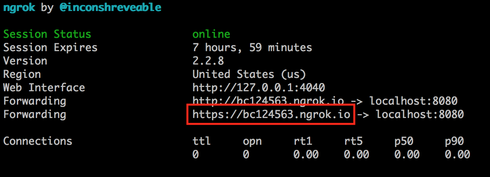
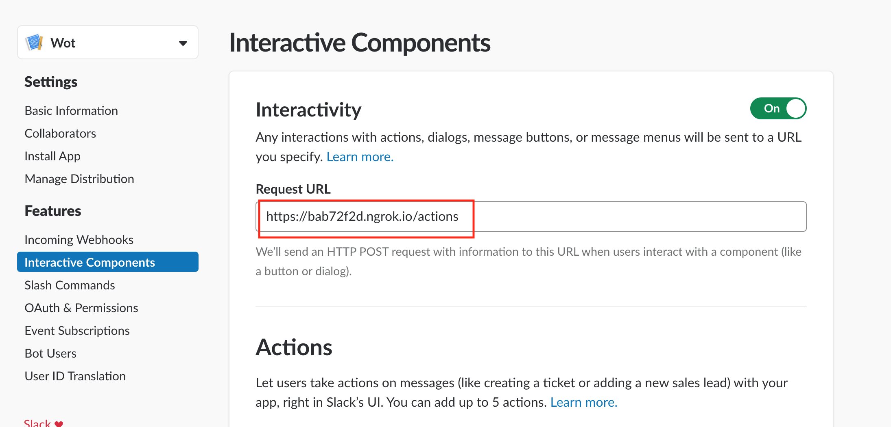

Bot Engine
----------

## Setup

```
./script/bootstrap
```

### Running a development server

```
SLACK_API_TOKEN=XXXX SLACK_VERIFICATION_TOKEN=YYYY ./script/run
```

To get the values for `SLACK_API_TOKEN` and `SLACK_VERIFICATION_TOKEN`, go to your [Slack apps page](https://api.slack.com/apps). Inside the *Basic Information* section you'll find the credentials information.

#### Configure Slack interaction

When using Slack's interactive messages, you need to configure a callback URL for your application. In a development environment the easiest way to do that is to use [ngrok](https://ngrok.com/).

 * Install ngrok
  * macOS: `brew cask install ngrok`
  * manual install: [download](https://ngrok.com/download)
 * run bot engine server: `SLACK_API_TOKEN=XXXX SLACK_VERIFICATION_TOKEN=YYYY ./script/run`
 * run ngrok: `ngrok http 8080`
 * Setup your Slack App's interactive request URL. Go to your [Slack apps page](https://api.slack.com/apps) and use the reported server URL by ngrok as the interactive request URL. The URL is the one reported by ngrok as the Forwarding URL, it should be similar to `https://bc123456.ngrok.io`. Don't forget to append the `/actions` path to it, `https://bc123456.ngrok.io/actions`.

 
 
